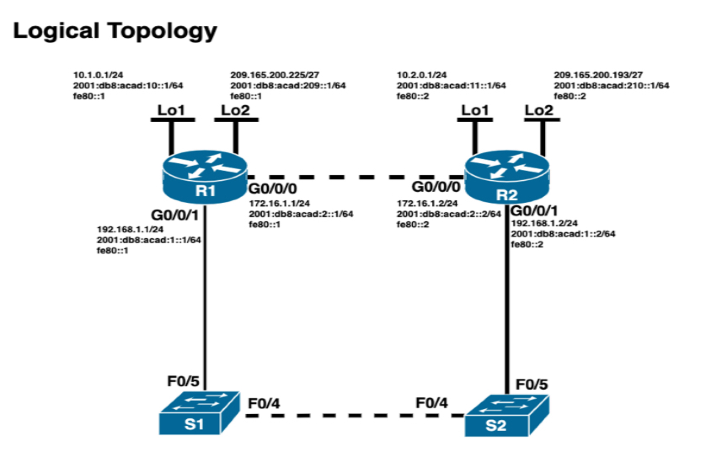
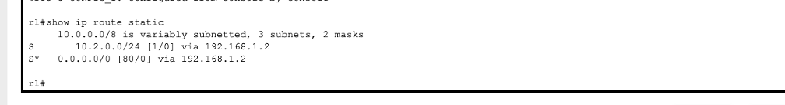
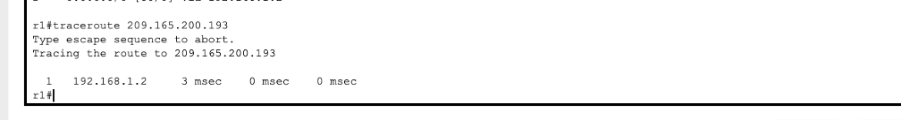
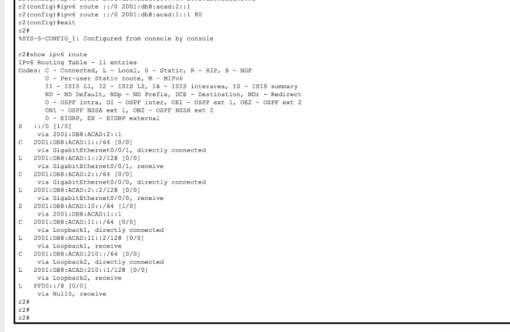
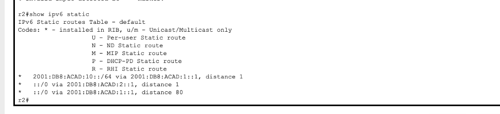
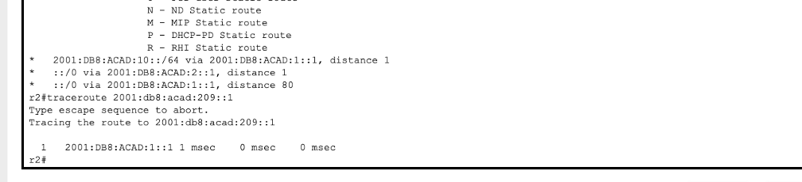
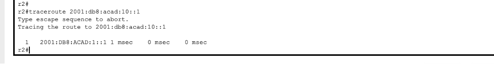
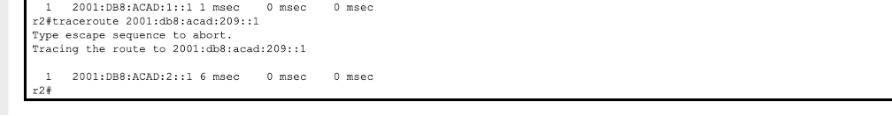

# StaticDefaultRouting
This project demonstrates my ability to design, configure, and verify static and default routing for both IPv4 and IPv6 in a multi-router environment. The lab uses two Cisco 4331 routers, two switches, and end devices to build a functional routed network supporting dual-stack (IPv4 + IPv6) communication.

# Objectives

The goal of this lab was to:

Build and cable the network topology

Apply basic device configuration (hostnames, passwords, banners, securing access)

Configure IPv4 and IPv6 addressing across router interfaces and loopbacks

Configure static routes, default routes, and floating static routes for both IPv4 and IPv6

Validate connectivity using ping, traceroute, and routing-table verification
_________________

# Topology

The network consists of:

2 Routers (R1 & R2)

2 Switches (S1 & S2)

1 PC

Multiple interfaces (GigabitEthernet, Loopbacks)

Dual-stack IP addressing (IPv4 + IPv6)

The topology includes multiple routed subnets and loopback interfaces used to simulate additional networks.
_____________________

# Key Configurations Performed
1. Basic Router & Switch Setup

Assigned hostnames

Disabled DNS lookup

Configured encrypted passwords

Set console & VTY access control

Applied MOTD banners

Saved startup configuration

2. IPv4 & IPv6 Addressing

Configured on all router interfaces, including loopbacks:

Example (R1 G0/0/0):

ip address 172.16.1.1 255.255.255.0
ipv6 address fe80::1 link-local
ipv6 address 2001:db8:acad:2::1/64
no shutdown

3. IPv4 Static Routing

Configured:

Static route to R2’s Loopback1 via G0/0/1

Default route via R2’s G0/0/0

Floating static default route (AD = 80) via G0/0/1

Example:

ip route 10.2.0.0 255.255.255.0 192.168.1.2

ip route 0.0.0.0 0.0.0.0 172.16.1.2

ip route 0.0.0.0 0.0.0.0 192.168.1.2 80

4. IPv6 Static Routing

Configured:

Static route to R1 Loopback

Default route via G0/0/0

Floating static default route with AD = 80

Example:

ipv6 route 2001:db8:acad:10::/64 2001:db8:acad:1::1

ipv6 route ::/0 2001:db8:acad:2::1

ipv6 route ::/0 2001:db8:acad:1::1 80

5. Routing Verification
____________________________

Used:

show ip route

show ipv6 route

Pings to next-hop addresses

Traceroutes to loopbacks demonstrating route preference
(Primary vs. floating default)

When shutting down an interface, the floating routes became active as expected, validating redundancy behavior.

_________________________________

# Skills Demonstrated

✔ IPv4 & IPv6 subnetting and addressing
✔ Cisco IOS configuration
✔ Static routing & route prioritization
✔ Default routes & floating static routes (AD manipulation)
✔ Dual-stack network design
✔ Routing table analysis
✔ Network troubleshooting (ping, traceroute, CDP)
________________________________
# Technologies Used

Cisco 4331 Routers

Cisco 2960 Switches

Cisco IOS CLI

Static IPv4 & IPv6 Routing

Link-local addressing

Routing table verification tools

________________________________

# This lab demonstrates real-world routing fundamentals, including:

Designing networks with redundancy

Understanding route selection and failover

Configuring IPv4/IPv6 coexistence

Verifying multi-router connectivity

Applying Cisco best practices for device hardening

This is foundational experience for roles involving routing, switching, and network infrastructure engineering.
